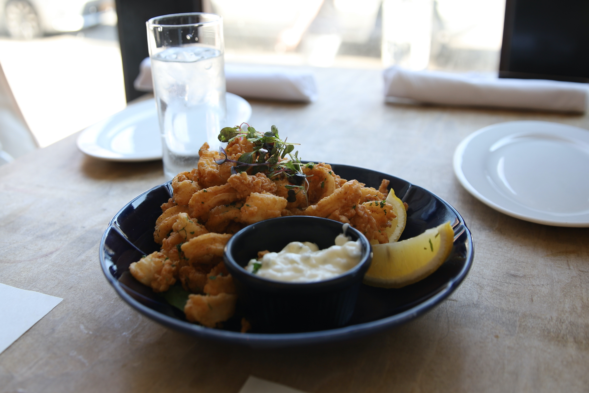

<html>
<meta name="viewport" content="width=device-width, initial-scale=1">

<body>

  

    
1 / 6

    
  

  

    
2 / 6

    
  

  

    
3 / 6

    
  

    
  

    
4 / 6

    
  

  

    
5 / 6

    
  

    
  

    
6 / 6

    
  

    
  <a class="prev" onclick="plusSlides(-1)">❮</a>
  <a class="next" onclick="plusSlides(1)">❯</a>

  

    

  

  

    

      
    

    

      
    

    

      
    

    

      
    

    

      
    
    
    

      
    

  

    
</body>
</html>
